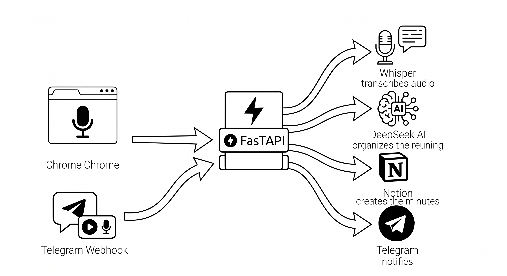

# 🎙️ RECORD-AI

> [🇧🇷 Português](README.md) | 🇺🇸 English

Record meetings from your browser and get the **finished minutes in Notion**, with real-time progress updates on Telegram — all **self-hosted**.



## ✨ What it does

1. You record the meeting audio with the Chrome extension (or send a voice message to the Telegram bot).
2. The API transcribes locally with **Whisper** (no audio sent to third-party transcription services).
3. **DeepSeek** organizes the transcription into structured minutes: executive summary, topics, decisions, and next steps with owners and deadlines.
4. The minutes automatically become a **Notion page**.
5. **Telegram** only receives status updates: received → transcribing → organizing → link to the minutes.

## 📁 Structure

| Folder | Description |
|--------|-------------|
| [`record-ai-api/`](record-ai-api/) | FastAPI API (secure proxy + transcription + Notion) — run with Docker |
| [`record-ai-chrome-extension-v3/`](record-ai-chrome-extension-v3/) | Chrome extension (Manifest V3) that records and sends the audio |

## 🔒 Why self-hosted?

- The **Telegram bot token** and **chat IDs** live only on the server (`.env`) — never in the browser.
- The extension stores only the **API URL** and an **API Key** that you define.
- Transcription runs **locally** (Whisper on your machine) — audio never goes through external transcription APIs.

## 🚀 Quick setup

### 1. Start the API

```bash
cd record-ai-api
cp .env.example .env   # fill in bot token, chat ID, API key, DeepSeek and Notion
docker-compose up -d
curl http://localhost/health
```

Details on each variable and endpoint: [`record-ai-api/README.md`](record-ai-api/README.md) (Portuguese)

### 2. Install the extension

1. Open `chrome://extensions/` in Chrome/Brave
2. Enable **Developer mode**
3. **Load unpacked** → select the `record-ai-chrome-extension-v3/` folder

### 3. Configure the extension

1. Click the extension icon → **"⚙️ Configurar API"**
2. Enter:
   - **API URL**: `http://localhost` (or your domain, e.g. `https://record-ai.yourdomain.com`)
   - **API Key**: the value of `RECORD-AI_API_KEY` from your `.env`
3. **Save**

## 🎙️ How to use

1. Click the icon → **"🔴 Abrir Gravador"** (Open Recorder)
2. In the recorder tab, click **"🎙️ Permitir Microfone"** (Allow Microphone)
3. **"🔴 Iniciar Gravação"** (Start Recording) → speak (the wave visualizer confirms capture)
4. **"⏹️ Parar Gravação"** (Stop Recording) → the audio goes to your API
5. Follow along on Telegram: the bot reports each step and sends the **Notion minutes link** at the end

It also works the other way around: send a **voice message directly to the bot** on Telegram and the same minutes pipeline is triggered (requires the configured webhook — see the API README).

## ⚙️ Requirements

- **Docker** (for the API) — or Python 3.11 + ffmpeg to run without a container
- **Telegram bot** created with [@BotFather](https://t.me/BotFather)
- **DeepSeek API key** ([platform.deepseek.com](https://platform.deepseek.com))
- **Notion integration** ([notion.so/my-integrations](https://www.notion.so/my-integrations)) with access to the parent page
- Chrome/Brave for the extension

## 📝 License

Use it however you like — self-host, modify, contribute.
