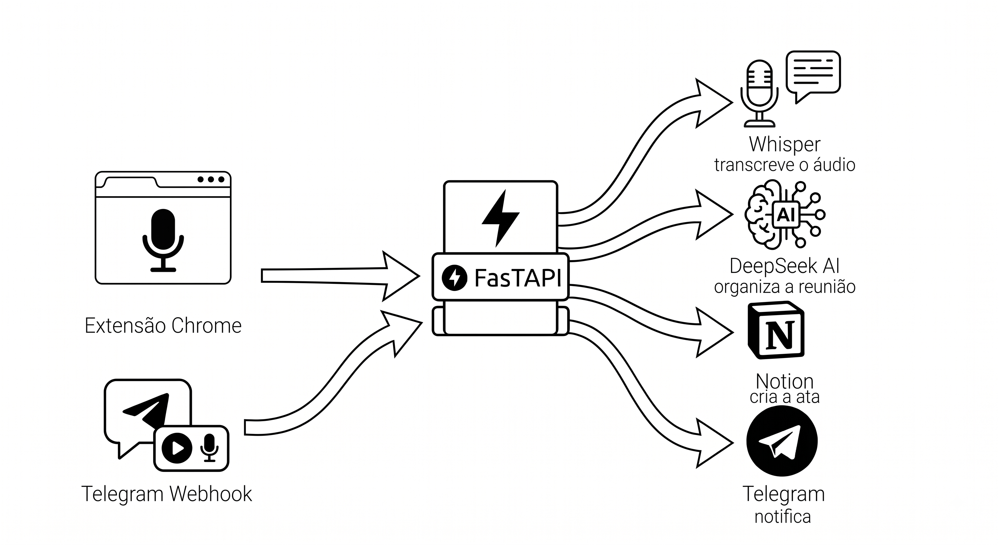

# 🎙️ RECORD-AI

> 🇧🇷 Português | [🇺🇸 English](README.en.md)

Grave reuniões pelo navegador e receba a **ata pronta no Notion**, com acompanhamento em tempo real pelo Telegram — tudo **self-hosted**.



## ✨ O que ele faz

1. Você grava o áudio da reunião pela extensão Chrome (ou envia um áudio pro bot no Telegram).
2. A API transcreve localmente com **Whisper** (nada de áudio em serviço de terceiros).
3. O **DeepSeek** organiza a transcrição em uma ata estruturada: resumo executivo, tópicos, decisões e próximos passos com responsáveis e prazos.
4. A ata vira uma **página no Notion** automaticamente.
5. O **Telegram** recebe apenas os status: recebido → transcrevendo → organizando → link da ata.

## 📁 Estrutura

| Pasta | Descrição |
|-------|-----------|
| [`record-ai-api/`](record-ai-api/) | API FastAPI (proxy seguro + transcrição + Notion) — rode com Docker |
| [`record-ai-chrome-extension-v3/`](record-ai-chrome-extension-v3/) | Extensão Chrome (Manifest V3) que grava e envia o áudio |

## 🔒 Por que self-hosted?

- O **token do bot do Telegram** e os **chat IDs** ficam só no servidor (`.env`) — nunca no navegador.
- A extensão guarda apenas a **URL da API** e uma **API Key** que você define.
- A transcrição roda **localmente** (Whisper na sua máquina) — o áudio não passa por APIs de transcrição externas.

## 🚀 Setup rápido

### 1. Suba a API

```bash
cd record-ai-api
cp .env.example .env   # preencha token do bot, chat ID, API key, DeepSeek e Notion
docker-compose up -d
curl http://localhost/health
```

Detalhes de cada variável e endpoints: [`record-ai-api/README.md`](record-ai-api/README.md)

### 2. Instale a extensão

1. Abra `chrome://extensions/` no Chrome/Brave
2. Ative o **Modo desenvolvedor**
3. **Carregar sem compactação** → selecione a pasta `record-ai-chrome-extension-v3/`

### 3. Configure a extensão

1. Clique no ícone da extensão → **"⚙️ Configurar API"**
2. Informe:
   - **URL da API**: `http://localhost` (ou seu domínio, ex: `https://record-ai.seudominio.com`)
   - **API Key**: o valor de `RECORD-AI_API_KEY` do seu `.env`
3. **Salvar**

## 🎙️ Como usar

1. Clique no ícone → **"🔴 Abrir Gravador"**
2. Na aba do gravador, clique em **"🎙️ Permitir Microfone"**
3. **"🔴 Iniciar Gravação"** → fale (o visualizador de ondas confirma a captura)
4. **"⏹️ Parar Gravação"** → o áudio vai para a sua API
5. Acompanhe no Telegram: o bot avisa cada etapa e manda o **link da ata no Notion** ao final

Também funciona ao contrário: envie um **áudio/voice note direto pro bot** no Telegram e o mesmo fluxo de ata é disparado (requer o webhook configurado — veja o README da API).

## ⚙️ Requisitos

- **Docker** (para a API) — ou Python 3.11 + ffmpeg para rodar sem container
- **Bot do Telegram** criado no [@BotFather](https://t.me/BotFather)
- **Chave da API DeepSeek** ([platform.deepseek.com](https://platform.deepseek.com))
- **Integração do Notion** ([notion.so/my-integrations](https://www.notion.so/my-integrations)) com acesso à página pai
- Chrome/Brave para a extensão

## 📝 Licença

Use como quiser — self-host, modifique, contribua.
